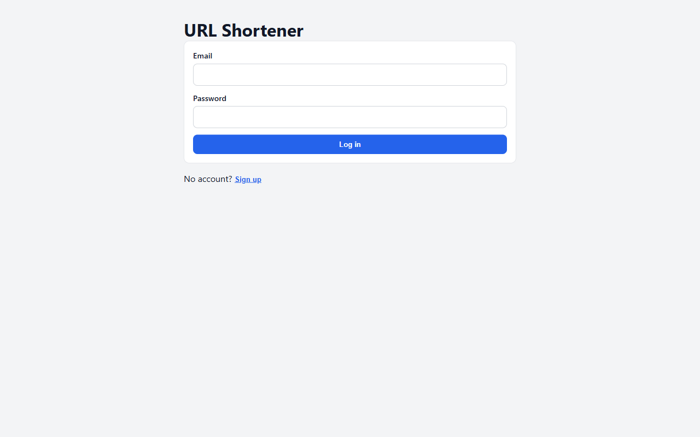
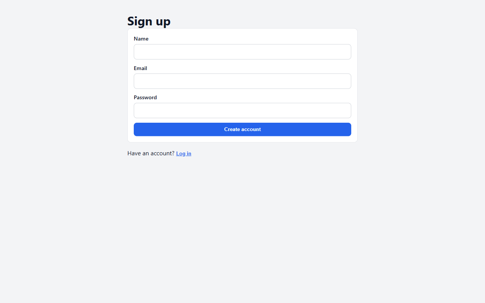
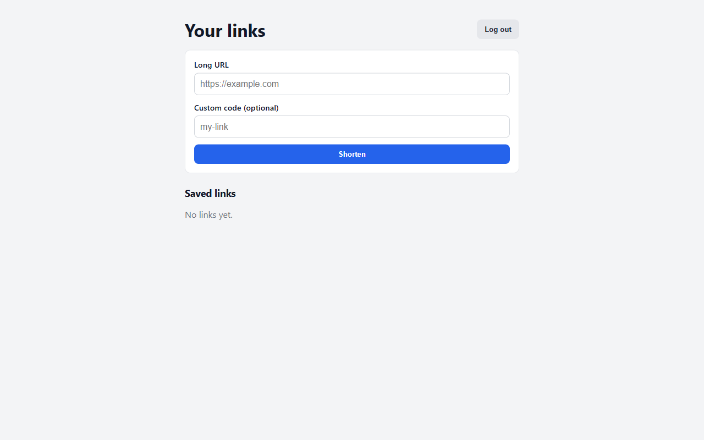
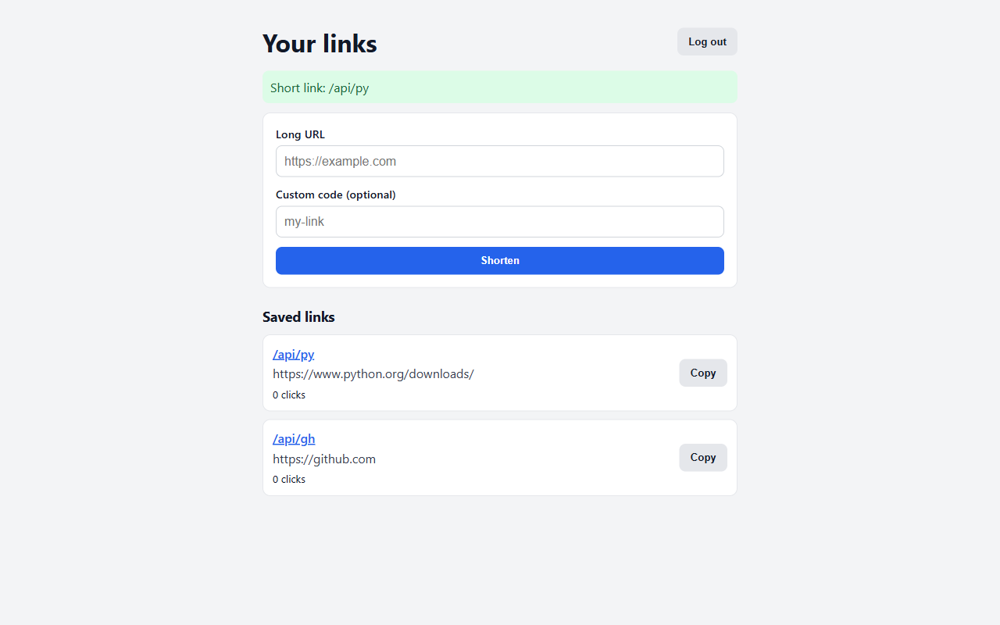
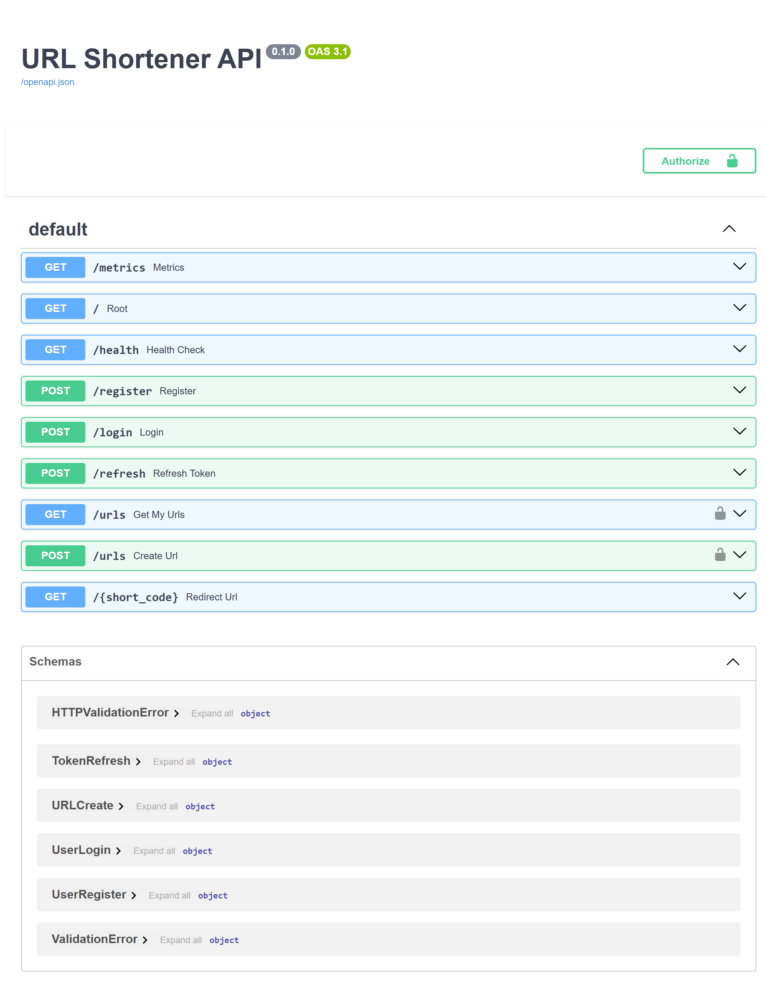
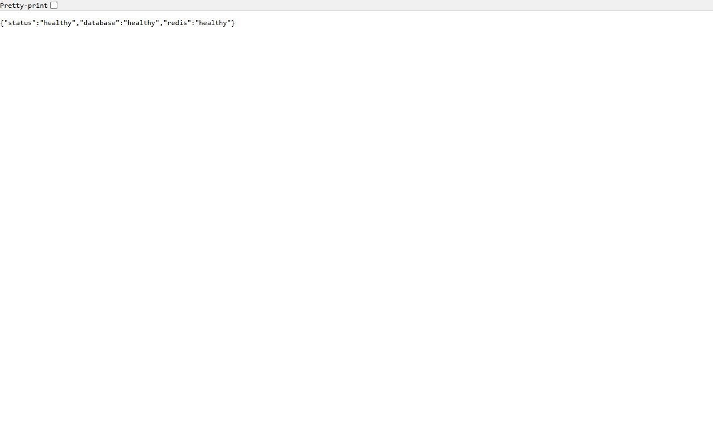
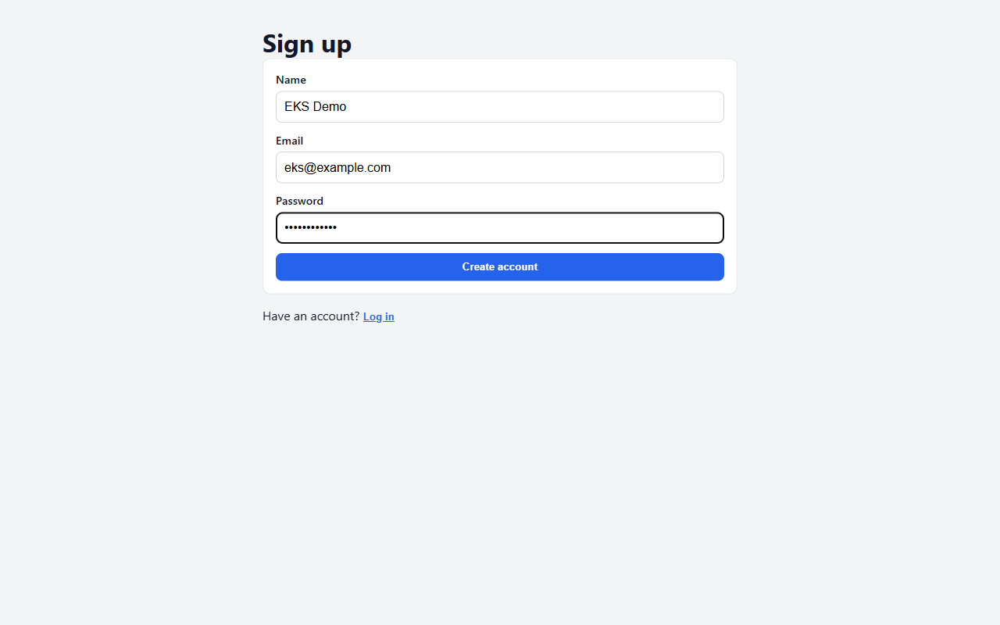
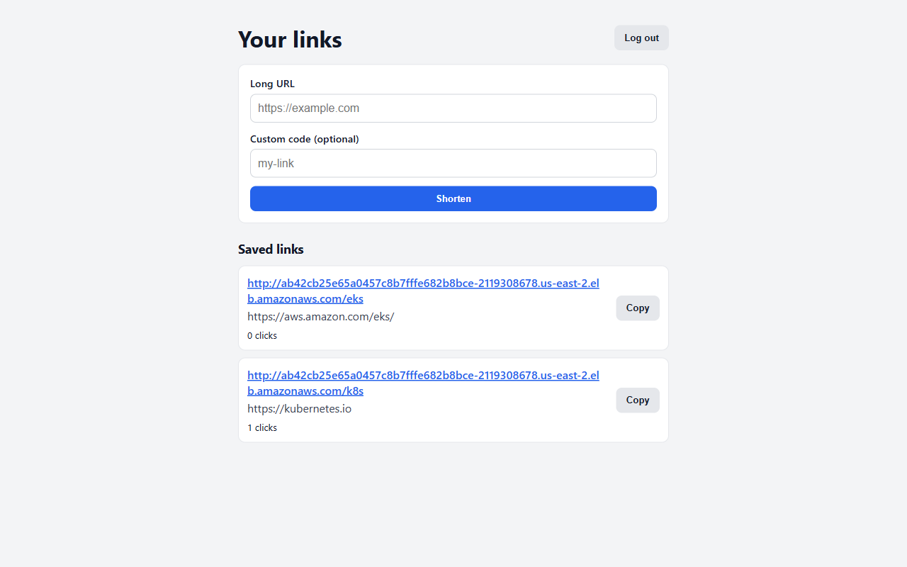

# URL Shortener

A full-stack URL shortener I built while learning backend development and DevOps.

You can sign up, log in, create short links (random or custom codes), and track click counts. It uses FastAPI, React, Postgres, Redis, Docker, Terraform, SNS/SQS workers, Kubernetes on Minikube, and a short Amazon EKS demo.

I don't leave AWS running all the time. When I need a demo I apply Terraform, then destroy it when I'm done so it doesn't keep costing money.

**Repo:** [github.com/agupta362/url-shortener](https://github.com/agupta362/url-shortener)

**Releases:** [v0.2.0](https://github.com/agupta362/url-shortener/releases/tag/v0.2.0) · [v0.3.0](https://github.com/agupta362/url-shortener/releases/tag/v0.3.0) · [v0.4.0](https://github.com/agupta362/url-shortener/releases/tag/v0.4.0)

## Screenshots

### App (local / EC2)

| Login | Sign up |
|-------|---------|
|  |  |

| Empty dashboard | Links with click counts |
|-----------------|-------------------------|
|  |  |

| API docs (Swagger) | Health check |
|--------------------|--------------|
|  |  |

### Amazon EKS demo

| Login | Sign up | Dashboard |
|-------|---------|-----------|
|  |  |  |


## Features

* Register and login with bcrypt password hashing and JWT access + refresh tokens
* Create short URLs with a random code or your own custom code (like `/gh` or `/k8s`)
* Click counts updated in the background through a message queue
* Redis caches redirects so Postgres is not hit on every click
* Redis also rate-limits login attempts
* Frontend and API share one origin (`/api/...`), so the browser never hardcodes an API host

## Tech stack

| Area | Tools |
|------|-------|
| Backend | Python, FastAPI |
| Frontend | React, Vite, Nginx |
| Database / cache | PostgreSQL, Redis |
| Auth | bcrypt, JWT |
| Messaging | AWS SNS, SQS, LocalStack |
| Containers | Docker, Docker Compose, multi-stage builds |
| Kubernetes | Minikube, Amazon EKS |
| AWS | EC2, RDS, ECR, SSM, IAM, Load Balancer |
| Infrastructure as code | Terraform |
| CI/CD | GitHub Actions (SSH deploy to EC2) |
| Ops extras | `/health`, Prometheus `/metrics`, JSON logs, k8s probes |

## Concepts and practices I learned on this project

* REST API design with FastAPI and OpenAPI/Swagger docs
* Auth with hashed passwords, short-lived access tokens, and refresh tokens
* Caching hot reads (redirects) and rate limiting with Redis
* Async work with SNS fan-out into multiple SQS queues and background workers
* Why you keep slow analytics off the redirect path
* Docker multi-stage builds, Compose networking, and env-based config
* LocalStack so you can practice SNS/SQS without paying for AWS every time
* Terraform remote state (S3 + lock), separate stacks, and SSM for secrets
* Deploying with GitHub Actions over SSH
* Kubernetes basics: Deployments, Services, ConfigMaps, Secrets, Ingress, probes
* Pushing images to ECR and running the same manifests on EKS
* Destroying cloud resources after a demo to control cost

## How it works

```text
Browser  →  Frontend (Nginx)
              ├─ /           → React app
              ├─ /api/...    → FastAPI (register, login, create URL)
              └─ /k8s        → FastAPI redirect
                                ├─ lookup in Redis / Postgres
                                ├─ publish click event to SNS
                                └─ 307 redirect to original URL

SNS fans out to:
  ├─ SQS (analytics) → worker updates click count in Postgres
  └─ SQS (logger)    → logger-worker writes a log line
```

Redirect stays fast because the API only publishes a small message. Workers update the database later. Two queues mean analytics and logging each get their own copy of the event (fan-out).

| Environment | Messaging |
|-------------|-----------|
| Docker Compose / Minikube | LocalStack (fake SNS/SQS) |
| EC2 (`terraform/infras`) | Real SNS/SQS + RDS, config from SSM |
| EKS (`terraform/eks`) | Cluster + ECR + LoadBalancer; in-cluster Postgres/Redis/LocalStack for a short demo |

**Auth flow:** register stores a bcrypt hash → login checks the hash and returns access + refresh tokens → frontend sends the access token → on 401 it calls `/refresh` instead of forcing a full login again.

## How I built it (phases)

I built this in steps over time, roughly in this order:

1. FastAPI backend (register, login, create/list/redirect URLs)
2. Simple React frontend
3. First AWS deploy + GitHub Actions
4. Redis for caching and login rate limiting
5. Terraform for EC2, IAM, SSM, and remote state
6. Better Docker setup (multi-stage builds, networks, volumes)
7. Kubernetes on Minikube (manifests, probes, JSON logging)
8. Frontend container + `/api` reverse proxy routing
9. RDS and clean short links (`/gh` instead of `/api/gh`)
10. SNS/SQS click tracking (LocalStack, then real AWS)
11. Workers + LocalStack on Minikube
12. EKS demo (cluster, ECR, LoadBalancer), then destroy

Bigger checkpoints are tagged as **v0.2** (RDS + clean URLs), **v0.3** (messaging), and **v0.4** (EKS).

## Project layout

```text
.
├── main.py, database.py, auth.py, models.py   # FastAPI app
├── messaging.py, worker.py, logger_worker.py  # SNS/SQS produce + consume
├── Dockerfile, docker-compose.yml             # Local full stack
├── docker-compose.aws.yml                     # EC2: real AWS, no LocalStack
├── frontend/                                  # React + Nginx prod image
├── k8s/                                       # Minikube (+ EKS LB overlay)
├── terraform/
│   ├── bootstrap/                             # S3 state + lock (run once)
│   ├── infras/                                # EC2 + RDS + SNS/SQS
│   └── eks/                                   # EKS + ECR (separate state)
└── docs/screenshots/
```

## Run locally (Docker Compose)

Needs Docker Desktop.

```bash
git clone https://github.com/agupta362/url-shortener.git
cd url-shortener
```

Create a `.env` in the project root:

```env
DB_HOST=db
DB_NAME=urlshortener
DB_USER=postgres
DB_PASSWORD=yourpassword
REDIS_HOST=redis
SECRET_KEY=change-me-to-a-long-random-string
ALGORITHM=HS256
ACCESS_TOKEN_EXPIRE_MINUTES=30
REFRESH_TOKEN_EXPIRE_DAYS=7
```

Start everything (API, Postgres, Redis, LocalStack, workers, frontend):

```bash
docker compose up --build
```

| What | URL |
|------|-----|
| Frontend | http://localhost:8080 |
| API | http://localhost:8002 |
| Swagger docs | http://localhost:8002/docs |
| Health | http://localhost:8002/health |

Watch the workers:

```bash
docker compose logs worker logger-worker -f
```

Create a link in the UI, open the short URL, and both workers should log the same click.

### Frontend only (dev mode)

If the API is already running on port 8002:

```bash
cd frontend
npm install
npm run dev
```

Vite proxies `/api` to `http://localhost:8002` (see `frontend/vite.config.js`).

## Run on Minikube

```bash
minikube start
minikube addons enable ingress
```

Build and load images:

```bash
docker build -t url-shortener:v8 .
docker build -t url-shortener-frontend:v3 ./frontend
minikube image load url-shortener:v8
minikube image load url-shortener-frontend:v3
```

Create the secret and apply manifests (set `DB_HOST=postgres` in `.env` for the k8s Service name):

```bash
kubectl create secret generic app-secrets --from-env-file=.env
kubectl apply -f k8s/postgres.yaml -f k8s/redis.yaml -f k8s/localstack.yaml
kubectl apply -f k8s/messaging-config.yaml
kubectl apply -f k8s/api.yaml -f k8s/worker.yaml -f k8s/logger-worker.yaml
kubectl apply -f k8s/frontend.yaml -f k8s/ingress.yaml
kubectl get pods
```

Port-forward the API (useful if 8080 is already used by Compose):

```bash
kubectl port-forward svc/api 18002:8000
```

Then open http://127.0.0.1:18002/docs. You can also use Ingress with `minikube tunnel`.

## Deploy on AWS (EC2 + RDS + SNS/SQS)

Stack under `terraform/infras`: EC2 runs Docker Compose, RDS is Postgres, SNS/SQS handle clicks, secrets live in SSM, Terraform state lives in S3.

### One-time bootstrap

```bash
cd terraform/bootstrap
terraform init
terraform apply
```

Leave bootstrap alone unless you really mean to delete the state bucket and lock table.

### App infra

1. Copy `terraform/infras/terraform.tfvars.example` to `terraform.tfvars`
2. Set your EC2 `key_name` in `us-east-2`, plus DB password and JWT secret
3. Apply:

```bash
cd terraform/infras
terraform init
terraform plan
terraform apply
```

Outputs include `public_ip` and `rds_endpoint`.

* Frontend: `http://<public_ip>:8080`
* API: `http://<public_ip>:8002`
* Docs: `http://<public_ip>:8002/docs`

On boot, EC2 pulls SSM params, clones the repo, and starts Compose with `docker-compose.aws.yml` (real AWS messaging, no LocalStack, RDS as `DB_HOST`).

When you are done:

```bash
terraform destroy
```

### CI/CD

Push to `main` runs `.github/workflows/deploy.yml`. It SSHs into EC2, runs `git pull`, then `docker compose up --build`. Needs GitHub secrets: `EC2_HOST`, `EC2_USER`, `EC2_KEY`.

## Deploy on AWS (EKS)

Separate Terraform state under `terraform/eks`, so you can destroy EKS without touching the EC2/RDS stack.

```bash
cd terraform/eks
terraform init
terraform apply
```

Then roughly:

1. `aws eks update-kubeconfig --region us-east-2 --name url-shortener-eks`
2. Build and push images to the ECR URLs from Terraform outputs
3. Create `app-secrets`, apply `k8s/*.yaml`, point images at ECR, apply `k8s/eks-frontend-lb.yaml`
4. Open the LoadBalancer hostname from `kubectl get svc frontend`

Destroy when the demo is over (the control plane alone is about $0.10/hour):

```bash
cd terraform/eks
terraform destroy
```

## API overview

| Method | Path | Auth | Purpose |
|--------|------|------|---------|
| POST | `/register` | No | Create account |
| POST | `/login` | No | Get tokens (rate limited) |
| POST | `/refresh` | No | New access token |
| POST | `/urls` | Yes | Create short URL |
| GET | `/urls` | Yes | List your URLs and clicks |
| GET | `/{short_code}` | No | Redirect and enqueue click |
| GET | `/health` | No | App / DB / Redis status |
| GET | `/metrics` | No | Prometheus metrics |
| GET | `/docs` | No | Swagger UI |

Through the frontend host, use `/api/...`. Nginx or Ingress strips the `/api` prefix before FastAPI sees the request.

## Notes

* I destroy AWS when I'm not demoing. Screenshots stay in the repo.
* Don't commit `.env` or `*.tfvars` (they are gitignored).
* `terraform/bootstrap` is meant to stay; `infras` and `eks` are meant to be disposable.

Built as a learning project by [agupta362](https://github.com/agupta362).
